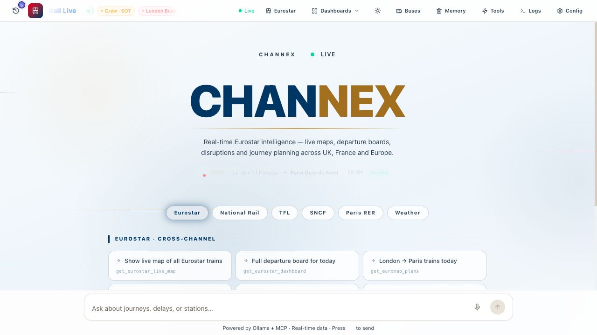
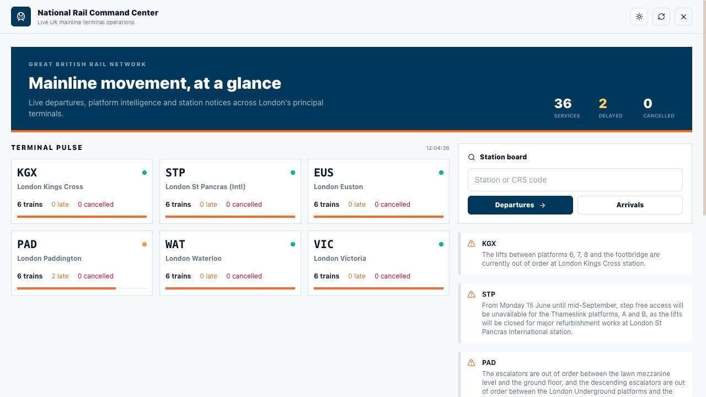
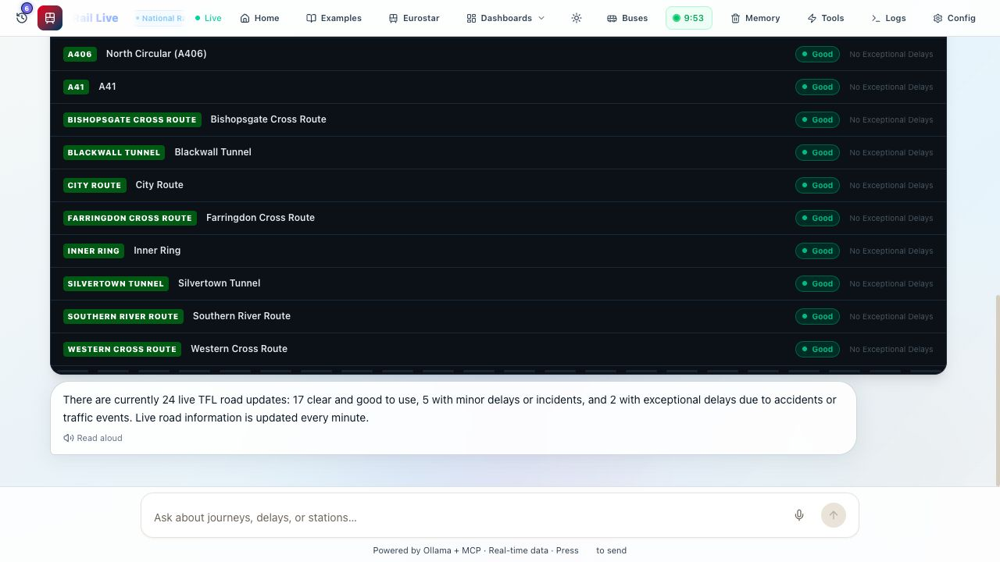

# Channex

Agentic rail and transport operations cockpit for Eurostar, TfL, SNCF, National Rail, Paris Metro, buses, roads, crew, weather, and live network dashboards.







## What It Does

Channex is a local-first transport assistant with a proper operations UI, not just a chat box.

- It uses a local LLM through Ollama.
- It exposes real transport tools through an MCP server.
- The Go backend runs the tool loop, streams responses, and keeps short-lived session memory.
- The frontend renders live tool responses as rich cards, maps, boards, and command centers.

You can ask things like:

```text
Show live map of all Eurostar trains
Last Eurostar from Paris tonight
Road status update operated by TfL
Arrivals at London Euston
SNCF departures from Lyon Part-Dieu
How busy is service 9005 today?
```

## Networks

- Eurostar: Euromap commercial plans, technical plans, live map, passenger loads, crew overlays
- TfL: journeys, line status, mode status, roads, road disruptions, bus arrivals, bus network
- SNCF: journeys, departures, arrivals, disruptions, train lookup, national dashboard
- National Rail: departures, arrivals, major London terminal dashboard
- Paris Metro / RER: departures for key Paris interchanges
- Shared context: weather and session memory

## Highlights

- Real MCP tool calling with deterministic Go-side tool routing
- Dedicated dashboards for Eurostar, TfL, SNCF, and National Rail
- Rich frontend cards for departures, arrivals, disruptions, maps, and operating pictures
- Light, dark, high-contrast, and compact display modes across the app
- Session memory with backend-enforced expiry and server-side flush
- Local LLM workflow, so you can run the whole stack without API billing for the model layer

## Architecture

```text
Browser UI (React + Vite)
  -> streams chat, dashboards, and tool cards

Go backend (:8080)
  -> receives the user message
  -> selects the relevant tool family
  -> asks the local LLM for tool calls
  -> executes tools through MCP
  -> streams tokens + tool events back to the browser
  -> stores short-lived session memory

Go MCP server (:8081)
  -> exposes transport tools for TfL, Eurostar, SNCF, National Rail, RATP, crew, weather

Ollama
  -> local model runtime

External data
  -> TfL
  -> SNCF / Navitia
  -> Eurostar internal-style feeds configured through env
  -> Huxley2 / Darwin-backed National Rail boards
```

## Screens To Show Off

- Landing experience with quick prompts and live network identity
- National Rail command center with terminal pulse, notices, and next movements
- TfL road-status tool response rendered directly in chat

The screenshots used in this README live in [docs/screenshots](/Users/khurramshahzad/Documents/code/prac/tfl-llm-sample/docs/screenshots).

## Stack

| Layer | Tech |
|---|---|
| Frontend | React 19, TypeScript, Vite, Tailwind, Framer Motion, Leaflet |
| Backend | Go, Gin |
| MCP | `mark3labs/mcp-go` |
| Local model | Ollama |
| Data sources | TfL, SNCF/Navitia, Eurostar-related APIs, Huxley2/National Rail, RATP |

## Quick Start

### 1. Install prerequisites

- Go
- Node.js
- Ollama

Pull a local model:

```bash
ollama serve
ollama pull llama3.2
```

### 2. Configure `.env`

Project root:

```bash
TFL_APP_KEY=
SNCF_API_KEY=your_key_here
DARWIN_TOKEN=
EUROMAP_CLIENT_ID=
EUROMAP_CLIENT_SECRET=
TRAVELER_CLIENT_ID=
TRAVELER_CONSUMER_ID=
SOT_CLIENT_ID=
SOT_CLIENT_SECRET=
```

Not every feature needs every credential, but the richer Eurostar and crew flows do.

### 3. Start the stack

```bash
make dev
```

That starts:

- Ollama
- the MCP server
- the Go backend
- the frontend dev server

Open the frontend URL shown by Vite. In this repo it is commonly `http://localhost:3000`.

## Useful Endpoints

- `POST /api/chat`
- `GET /api/tfl/command-center`
- `GET /api/sncf/command-center`
- `GET /api/national-rail/command-center`
- `GET /api/eurostar/trains`
- `GET /api/crew/activities`
- `DELETE /api/memory/:sessionId`

## Memory

Session memory is intentionally short-lived.

- The frontend starts a 10-minute timer after completed turns.
- The backend also enforces a 10-minute TTL, so memory expires even if the browser never sends the flush request.
- Memory is stored per session, capped, atomically written, and excluded from the currently active conversation when injected back into the system prompt.

## Tool Selection

Tool selection is not left entirely to the model.

- The backend narrows the tool family first: Eurostar, TfL, SNCF, National Rail, Paris, Weather
- It then applies intent-specific selectors for each family
- It normalizes common tool alias mistakes and argument-shape mistakes before execution

That extra routing layer is what keeps prompts like `Road status update operated by TFL` from drifting into unrelated bus tools.

## Project Layout

```text
backend/
  handlers/         chat loop, dashboards, routing, memory flush
  llm/              Ollama-compatible client
  mcpclient/        MCP SSE client
  memory/           expiring session memory store

mcp-server/
  tools/            transport tools exposed to the model
  tfl/              TfL client
  sncf/             SNCF client
  nationalrail/     National Rail client
  euromap/          Eurostar plans and map data
  sotenabler/       crew activity integration

frontend/
  src/components/   rich cards, dashboards, command centers
  src/hooks/        chat streaming, memory timer, UI state

docs/screenshots/
  landing.jpg
  national-rail-dashboard.jpg
  road-status-tool.jpg
```

## Verification

Recent backend checks for this repo included:

```bash
go test -vet=off ./...
go test -race ./memory ./handlers
```

Frontend spot checks were done against the live app in the in-app browser, including theme contrast validation.

## License

MIT
